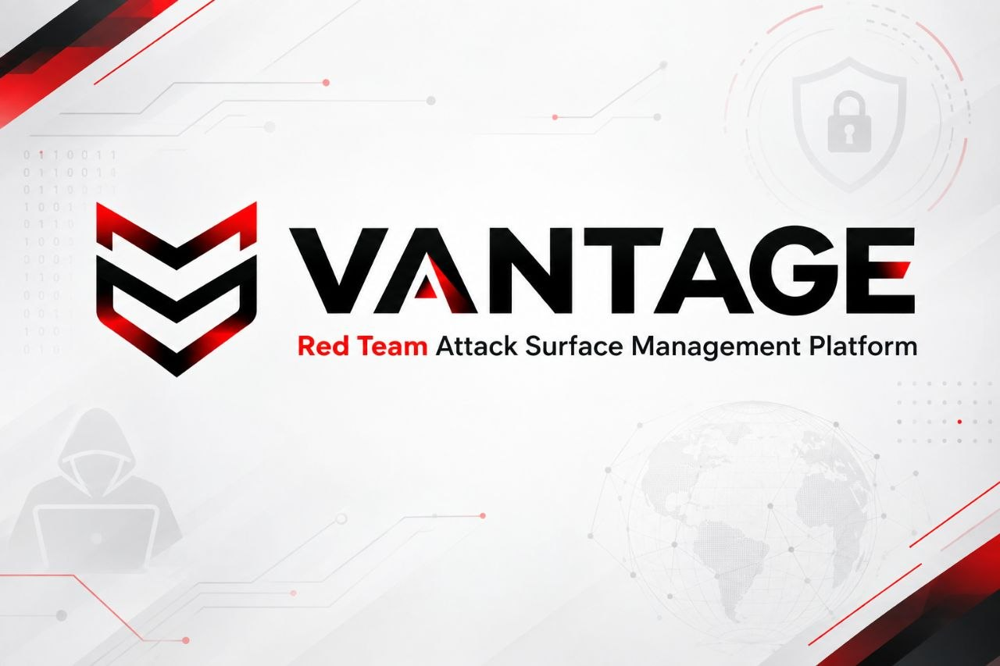

<p align="center">
  
</p>

# Vantage

**Red Team Attack Surface Management Platform**

Fully local. No paid APIs. No cloud. Built for red teams.

[](https://golang.org)
[](LICENSE)
[](https://github.com/expl0itlab/vantage)

---

## What Vantage Does

- **Subdomain enumeration** — subfinder, assetfinder, optional DNS bruteforce
- **HTTP probing** — live host detection, tech fingerprinting, TLS info (httpx)
- **Port scanning** — connect scan, top-100/1000/custom ports (naabu)
- **Banner grabbing** — real TCP banners with service/version parsing
- **Attack surface mapping** — 50+ tech/path/port signals with actionable notes per host
- **Screenshots** — auto-capture every live host (gowitness v3)
- **Network expansion** — found IP → scan the /24 for more hosts (aggressive only)
- **JS analysis** — extract secrets, API keys, endpoints from JavaScript files
- **Enhanced secrets detection** — 40+ patterns (cloud keys, JWTs, SSH/PGP keys, API tokens), Shannon entropy filtering, context capture
- **Tech check packs** — WordPress, Laravel, Django, Next.js, Jenkins, GitLab, Grafana, K8s, Elasticsearch, Docker — 11 packs, ~50 checks
- **Cloud asset discovery** — S3/Azure Blob/GCP Storage bucket detection, cloud IP ranges, K8s endpoints, Docker APIs
- **Smart alerts** — Telegram notifications with dedup, rate limiting, severity filtering per event type
- **Change tracking** — every new asset/host/port recorded as a change event
- **Exports** — Caido scope JSON, Burp Suite XML, Metasploit .rc, CSV, target lists
- **Dashboard** — dark web UI with SSE live updates

---

## Scan Profiles

| Profile | Ports | Rate | Banner | Screenshot | Bruteforce | Net Expand |
|---|---|---|---|---|---|---|
| `stealth` | 80,443,8080,8443 | 50/s | no | no | no | no |
| `standard` | top-100 | 500/s | yes | yes | no | no |
| `aggressive` | top-1000 | 2000/s | yes | yes | yes | yes |

---

## Requirements

- Linux (x86_64 or arm64)
- Go 1.22+
- gcc, libsqlite3-dev (for CGO sqlite)

---

## Installation

### Quick Install

```bash
git clone https://github.com/expl0itlab/vantage.git
cd vantage
chmod +x scripts/install.sh
./scripts/install.sh
```

### Build from Source

```bash
sudo apt-get install -y gcc libsqlite3-dev build-essential

# Install Go 1.22
wget https://go.dev/dl/go1.22.4.linux-amd64.tar.gz
sudo tar -C /usr/local -xzf go1.22.4.linux-amd64.tar.gz
export PATH=$PATH:/usr/local/go/bin

# Install recon tools
export PATH=$PATH:$(go env GOPATH)/bin
go install github.com/projectdiscovery/subfinder/v2/cmd/subfinder@latest
go install github.com/tomnomnom/assetfinder@latest
go install github.com/projectdiscovery/httpx/cmd/httpx@latest
go install github.com/projectdiscovery/naabu/v2/cmd/naabu@latest
go install github.com/projectdiscovery/dnsx/cmd/dnsx@latest
go install github.com/sensepost/gowitness@latest

# Naabu raw socket permission
sudo setcap cap_net_raw+ep $(which naabu)

# Build
CGO_ENABLED=1 go build -mod=vendor -o vantage ./cmd/
```

### Docker

```bash
docker compose up -d
```

---

## Usage

```bash
# One-shot scans
./vantage scan -d target.com                      # standard profile
./vantage scan -d target.com -p stealth           # passive, low noise
./vantage scan -d target.com -p aggressive        # everything, maximum coverage

# Dashboard (recommended for red team use)
./vantage serve                                   # http://127.0.0.1:8080

# Headless scheduler (no UI, runs on cron)
./vantage monitor

# Scan all targets from config
./vantage scan
```

---

## Dashboard Pages

| Page | What It Shows |
|---|---|
| **Dashboard** | Stats, recent scans, live activity log |
| **Assets** | All subdomains with IP, type, first seen |
| **Live Hosts** | HTTP/S hosts — status, title, tech, screenshots |
| **Ports** | All open ports with service, version, banner |
| **Attack Surface** | Per-host attack notes — what to check and how |
| **Interesting** | Admin panels, login pages, APIs, dev envs, risky ports |
| **JS Analysis** | Secrets, API keys, endpoints extracted from JS files |
| **Tech Checks** | Technology-specific check results — WordPress, Jenkins, Grafana, etc. |
| **Cloud Assets** | S3/Azure/GCP buckets, K8s endpoints, Docker APIs, cloud IP ranges |
| **Alerts** | Telegram alert history — what was sent and when |
| **Changes** | Every new finding across all scans |
| **Scans** | Full scan history with export |

---

## Exports (from Dashboard)

| Export | Use For |
|---|---|
| Caido scope JSON | Import as Caido target scope |
| Burp Suite XML | Import as Burp target scope |
| Metasploit .rc | `msfconsole -r file.rc` — pre-loaded modules per service |
| CSV (assets/hosts/ports/js) | Reporting, spreadsheets |
| URL list | Feed to any other tool |
| IP:port list | netcat, masscan, custom scripts |
| JSON export | Full domain snapshot |

---

## Configuration

Copy `vantage.example.yaml` to `vantage.yaml` and edit:

```bash
cp vantage.example.yaml vantage.yaml
nano vantage.yaml
```

Key config sections:

- `alerting` — Telegram bot token/chat ID, min severity, event type toggles (new_subdomain, high_risk_port, js_secret, interesting_host, host_down, new_technology)
- `tech_checks` — Enable/disable tech check packs, thread count, timeout
- `cloud_recon` — Enable/disable cloud asset discovery, timeout

See `vantage.example.yaml` for all available options with documentation.

---

## Contributing

See [CONTRIBUTING.md](CONTRIBUTING.md) for guidelines.

---

## License

MIT License. See [LICENSE](LICENSE).

---

## Built by

[Exploit Lab](https://github.com/expl0itlab)
